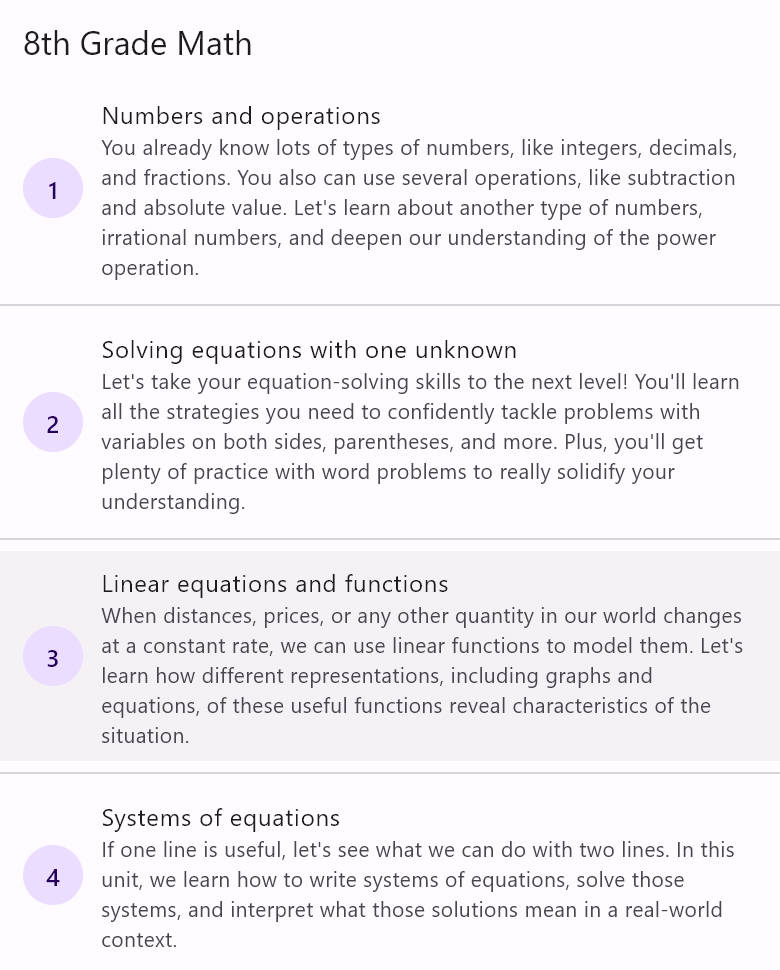
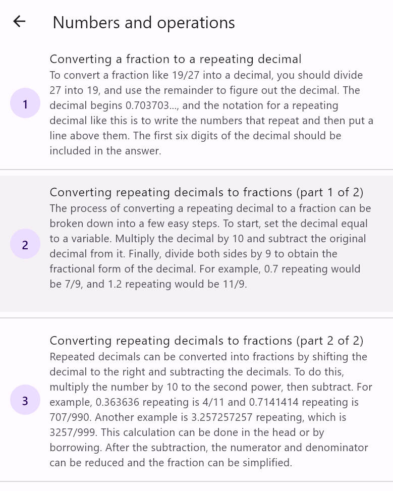
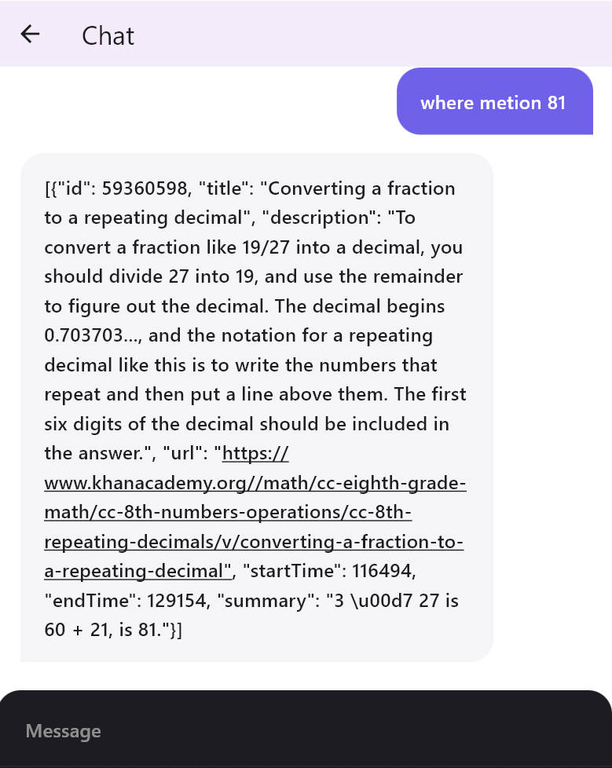
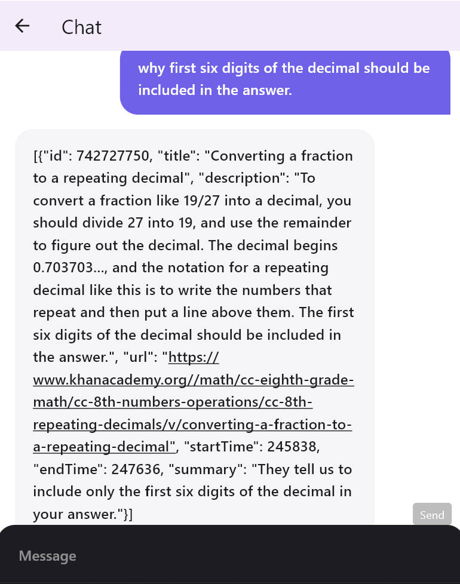

<<<<<<< HEAD
# SmartCourseQA
=======
# Project: Video Answer Bot

A GPT bot to answer questions in khanacademy cc-eighth-grade-math

## How to use

### Prerequisites

First use the command `flutter pub get` to get all the dependencies. Then run the
command `flutter run` to run the app.

### How to use

The app is very simple to use.
First Just select the unit about the course.

Then select the course you want to ask about.
mention that:

1. the course must be in the unit you selected.
2. Limited to the website spider, so you can't choose too much courses.

Then type your question and press the send button. The bot will answer you.

### about answer

The answer will include map in a list include startTime, endTime, title, description, and so on.
If it cannot answer the question you asked, it will give you a empty list.

## Server

- [Server](https://docs.flutter.dev/get-started/codelab)

### Prerequisites

You need to install python and flask first.It is recommended to use a virtual environment.

### How to use

First use the command `pip install -r requirements.txt` to get all the dependencies. Then run the
command `python app.py` to run the server.

### about structure

1. `app.py` is the main file of the server.
2. `spider.py` is the spider file to get the data from the website.
3. server will use cache to store the data, so it will not get the data from the website every time.
4. limited to the website's anti-spider technology, the server will be blocked if you send too many
   requests in a short time.
5. the server will use the `spider.py` to get the data from the website, and then use the `gpt.py`
   to
   answer the question.

### about answer

1. the answer will include map in a list include startTime, endTime, title, description, and so on.
2. if it cannot answer the question you asked, it will give you a empty list.
3. Server will not always give you a answer, if spider is down or the server is down, it will not
   give you a answer.
>>>>>>> 00d7003 (Initial commit)
